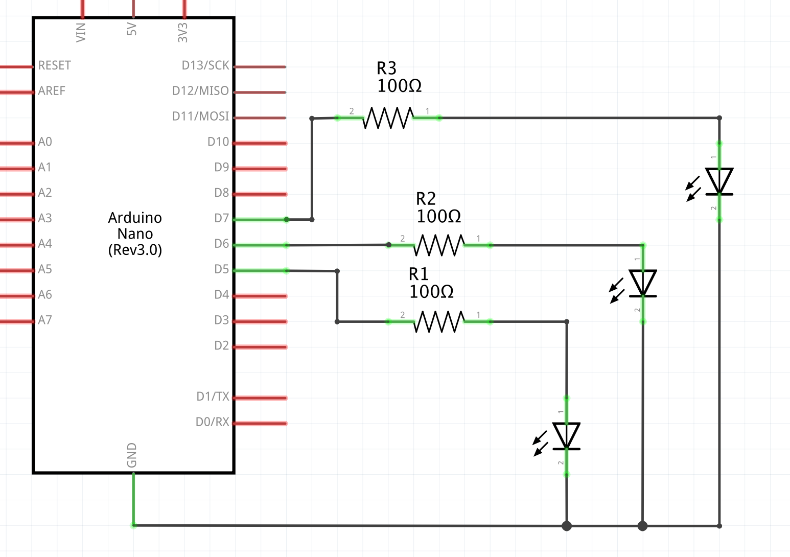
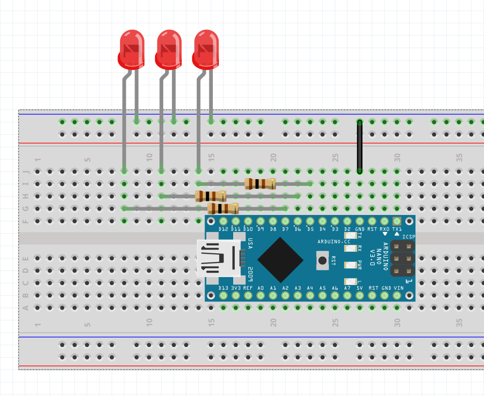

# digitalWrite()

A couple of examples of how to use ```digitalWrite()``` to make LEDs blink at specified frequencies.

Schematic:


Board:


## [blink-00](./blink-00/)
One LED, blocking.

## [blink-01-multiBlinkBad](./blink-01-multiBlinkBad/)
Two LEDs, blocking.  
Bad: one LED at a time.

## [blink-02-multiBlinkUgly](./blink-02-multiBlinkUgly/)
Two LEDs, blocking.  
Ugly: really complicated way to structure code to make LEDs blink at desired frequencies.

## [blink-03-multiBlinkGood](./blink-03-multiBlinkGood/)
Two LEDs, non-blocking.  
Uses variables to keep track of current state for each LED and when to update them.

## [blink-04-multiBlinkClass](./blink-04-multiBlinkClass/)
Two LEDs, non-blocking.  
Same logic as ```blink-03-multiBlinkGood```, but abstracted and wrapped inside a class.

## [blink-05-multiBlinkMod](./blink-05-multiBlinkMod/)
Two LEDs, non-blocking.  
Uses ```millis()``` and modular arithmetic to compute the state of each LED at each ```loop()``` iteration.
