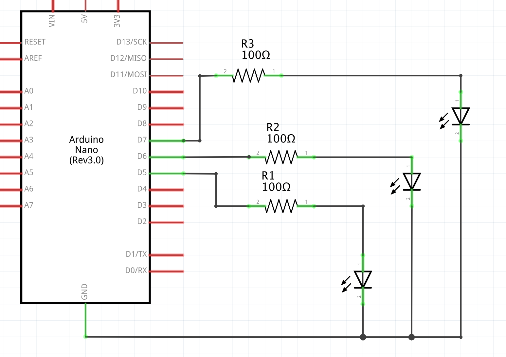
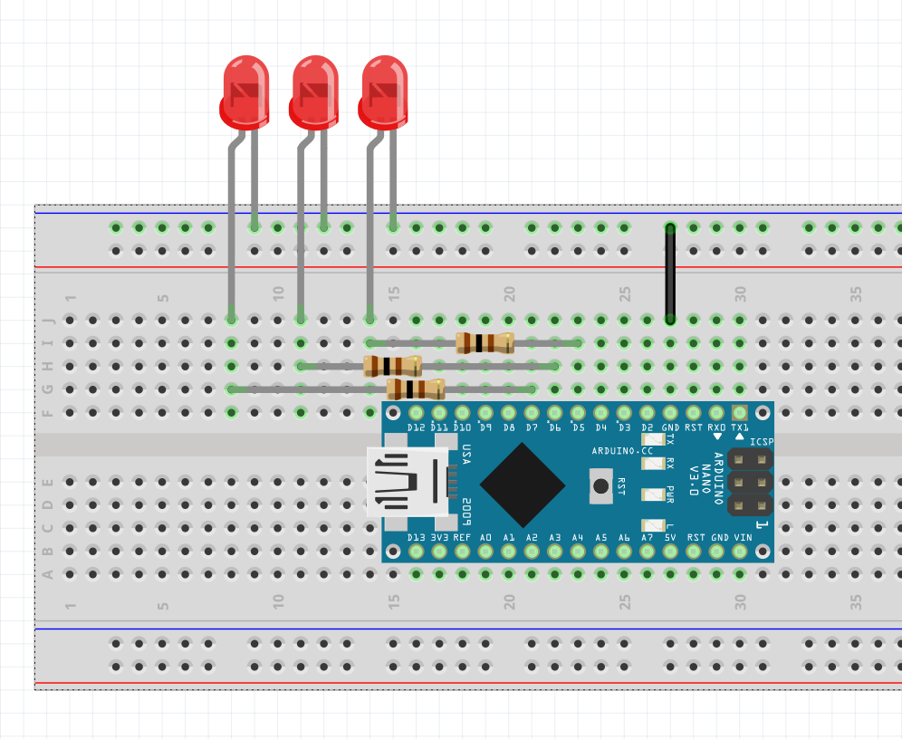
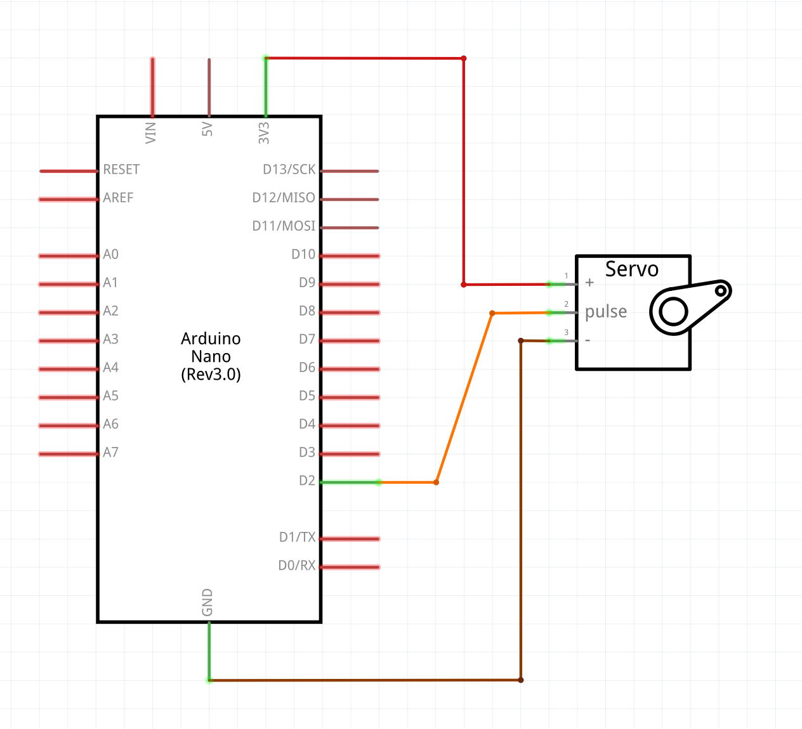
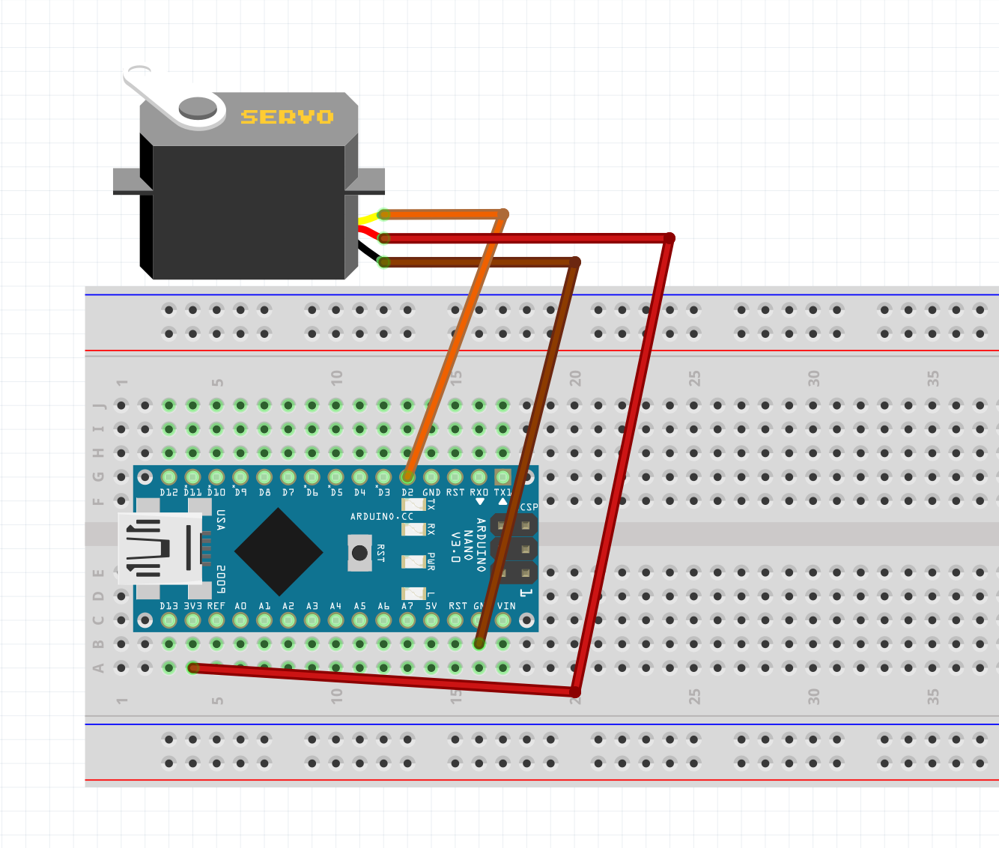

# analogWrite()

A couple of examples of how to use ```analogWrite()``` with LEDs.

Schematic:


Board:


## [analogWrite-00](./analogWrite-00/)
Turns on 3 LEDs with 3 different voltage levels.

## [analogWrite-01-fadeIn](./analogWrite-01-fadeIn/)
Fade-in one LED from 0 to full voltage, having it reset to 0 once it gets to full voltage.

## [analogWrite-02-fadeInOut](./analogWrite-02-fadeInOut/)
Fade one LED in and out, from 0 to full voltage and then back to 0 gradually.

## [analogWrite-03-servo](./analogWrite-03-servo/)
We don't explicitly use the ```analogWrite()``` function, but the code inside the Servo Library does something similar to what ```analogWrite()``` does with PWMs in order to move the servo to specified positions.

Schematic:


Board:

