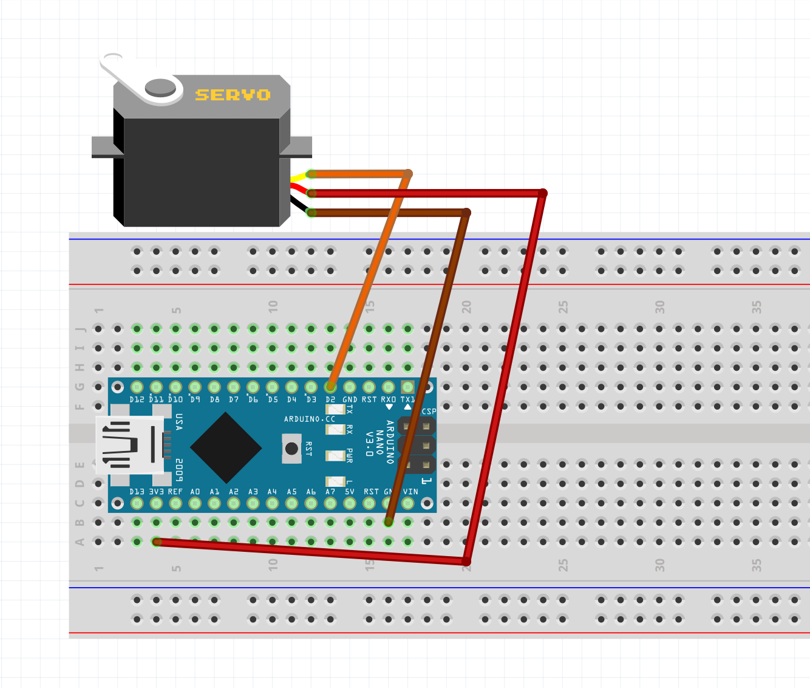

# analogWrite-03-servo
We don't explicitly use the ```analogWrite()``` function, but the code inside the Servo Library does something similar to what ```analogWrite()``` does with PWMs in order to move the servo to specified positions.

Schematic:


Board:

