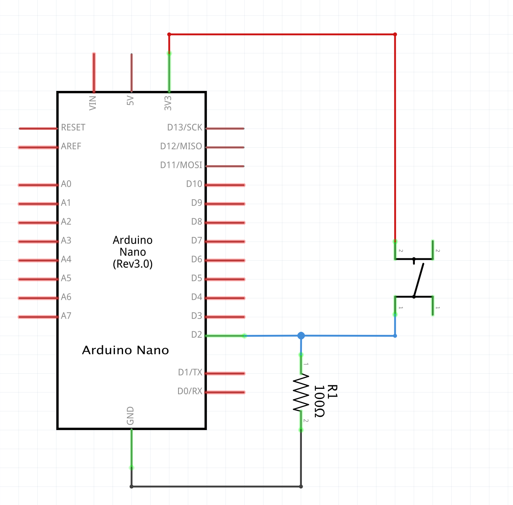
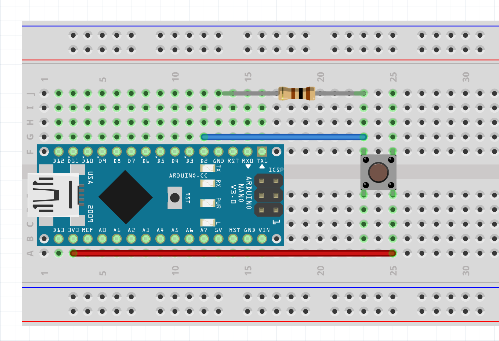
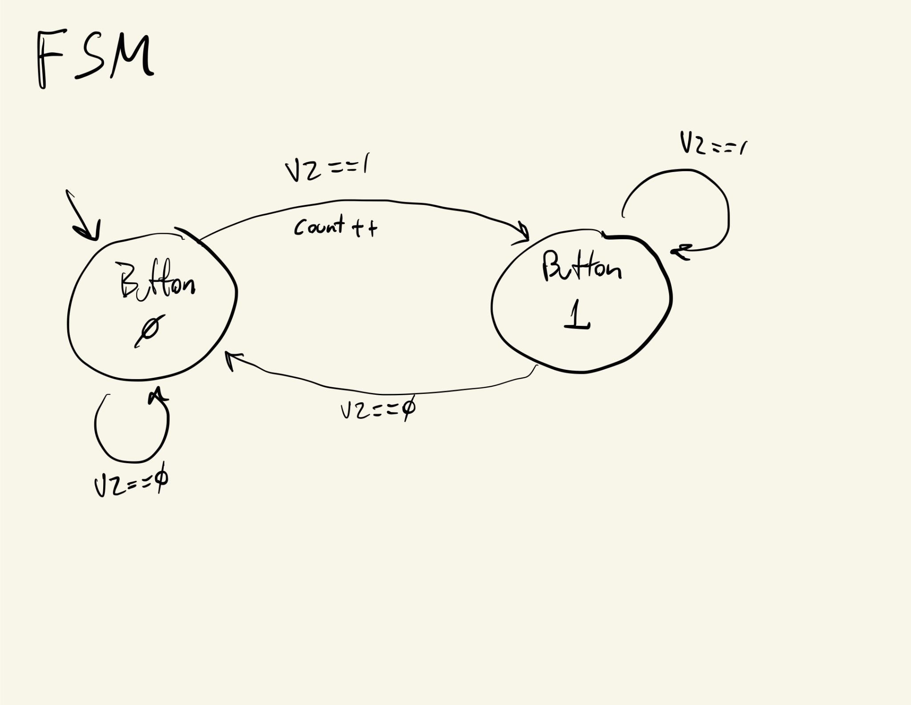
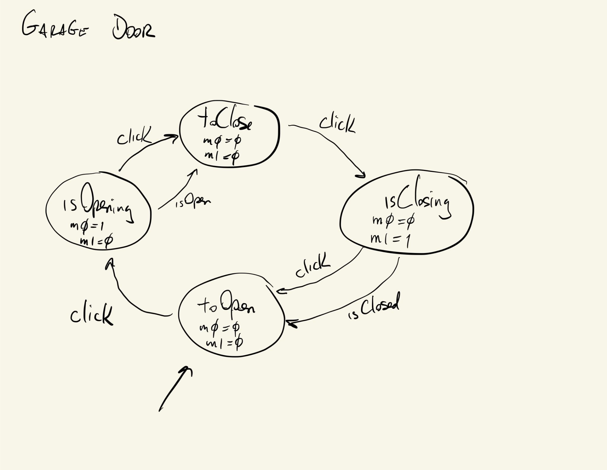

# digitalRead()

Examples of how to use ```digitalRead()``` with a switch or pushbutton.

Schematic:


Board:


## [digitalRead-00](./digitalRead-00/)
Read pushbutton state and print its value using the serial monitor.

## [digitalRead-01-count](./digitalRead-01-count/)
Use previous switch state to detect and count number of clicks.

## [digitalRead-02-FSM](./digitalRead-02-FSM/)
Use Finite State Machine abstraction to count the number of button clicks.



## [digitalRead-03-garage](./digitalRead-03-garage/)
Use Finite State Machine abstraction to simulate the logic for a possible system for controlling garage doors.


