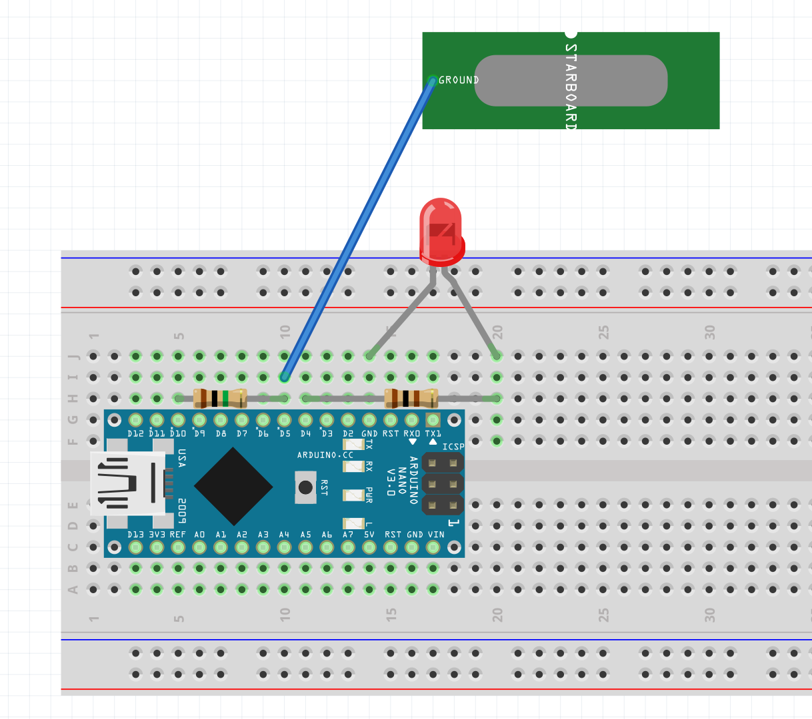

# analogRead()

Examples of how to use ```analogRead()``` with a potentiometer, photo-resistor and banana.

Schematic:


Board:


## [analogRead-00](./analogRead-00/)
An example of how to read values from a potentiometer and display them using the serial monitor.

## [analogRead-01-levels](./analogRead-01-levels/)
An example of how to read values from a potentiometer and display them using LEDs.

Schematic:


Board:


## [analogRead-02-LDR](./analogRead-02-LDR/)
An example of how to read values from a light sensitive resistor and display them using the serial monitor and an LED.

Schematic:


Board:


## [analogRead-03-banana](./analogRead-03-banana/)
An example of how to use the [Capacitive Sensing Library](https://playground.arduino.cc/Main/CapacitiveSensor/) to read capacitance at one of the arduino's pins and use it to detect touch on everyday objects. We're not using the ```analogRead()``` function, but since the values returned by the ```CapacitiveSensor``` object have a wide range of values, this is similar to an ```analogRead()``` operation.

Schematic:


Board:

