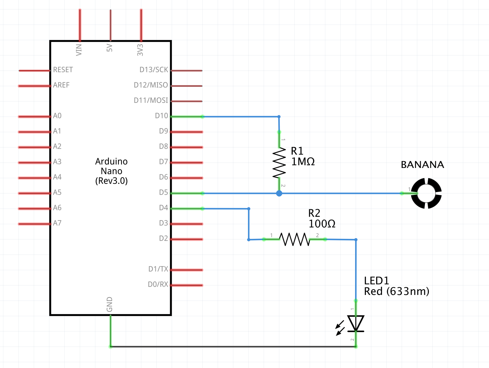
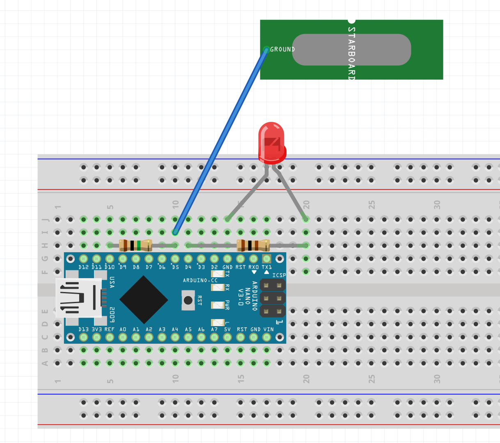

# analogRead-03-banana
An example of how to use the [Capacitive Sensing Library](https://playground.arduino.cc/Main/CapacitiveSensor/) to read capacitance at one of the arduino's pins and use it to detect touch on everyday objects. We're not using the ```analogRead()``` function, but since the values returned by the ```CapacitiveSensor``` object have a wide range of values, this is similar to an ```analogRead()``` operation.

Schematic:


Board:

